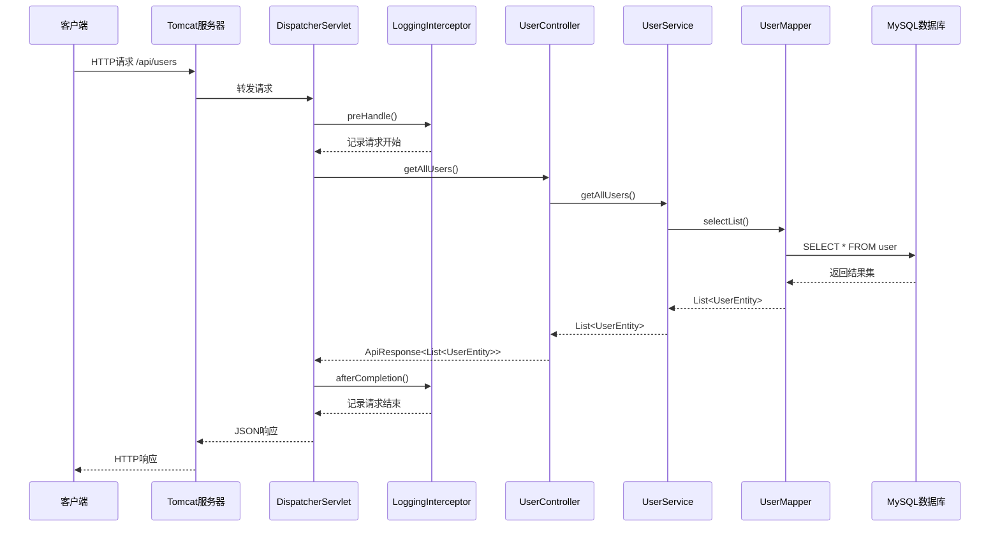

# Spring Boot 后端数据流通文档

## 文档信息
- **文档标题**: Spring Boot 后端数据流通架构说明
- **创建时间**: 2025-09-19
- **作者**: xxh
- **版本**: v1.0.0

## 目录
- [1. 概述](#1-概述)
- [2. 系统架构](#2-系统架构)
- [3. 数据流通详解](#3-数据流通详解)
- [4. 核心组件说明](#4-核心组件说明)
- [5. 请求处理流程](#5-请求处理流程)
- [6. 异常处理机制](#6-异常处理机制)
- [7. 性能监控](#7-性能监控)
- [8. 最佳实践](#8-最佳实践)

## 1. 概述

### 1.1 文档目标
本文档详细描述了Spring Boot应用中HTTP请求的完整数据流通过程，帮助开发人员理解系统架构和数据处理机制。

### 1.2 适用范围
- Spring Boot 2.x/3.x 应用
- RESTful API 接口开发
- MVC架构模式
- MySQL数据库集成

## 2. 系统架构

### 2.1 分层架构图
```
┌─────────────────────────────────────────────────────────┐
│                    客户端层                              │
│              (浏览器/移动端/第三方应用)                    │
└─────────────────────────────────────────────────────────┘
                            │ HTTP请求
                            ▼
┌─────────────────────────────────────────────────────────┐
│                   Web服务器层                            │
│                 (Tomcat 内嵌服务器)                      │
└─────────────────────────────────────────────────────────┘
                            │
                            ▼
┌─────────────────────────────────────────────────────────┐
│                   Spring MVC层                          │
│    DispatcherServlet → HandlerMapping → Controller      │
└─────────────────────────────────────────────────────────┘
                            │
                            ▼
┌─────────────────────────────────────────────────────────┐
│                    业务逻辑层                            │
│                   (Service层)                           │
└─────────────────────────────────────────────────────────┘
                            │
                            ▼
┌─────────────────────────────────────────────────────────┐
│                   数据访问层                             │
│                 (Mapper/Repository)                     │
└─────────────────────────────────────────────────────────┘
                            │
                            ▼
┌─────────────────────────────────────────────────────────┐
│                    数据存储层                            │
│                   (MySQL数据库)                         │
└─────────────────────────────────────────────────────────┘
```

### 2.2 技术栈组件
| 层级 | 技术组件 | 作用 |
|------|----------|------|
| **Web层** | Spring MVC, Tomcat | HTTP请求处理 |
| **控制层** | @RestController | 接口控制器 |
| **业务层** | @Service | 业务逻辑处理 |
| **数据层** | MyBatis, @Mapper | 数据库操作 |
| **数据库** | MySQL | 数据持久化 |

## 3. 数据流通详解

### 3.1 完整请求流程
以 `GET http://localhost:8080/api/users` 为例：

#### 阶段1: 请求接收 (Request Reception)
```
HTTP请求 → Tomcat服务器 → DispatcherServlet
```
**详细过程**:
1. 客户端发送HTTP请求到8080端口
2. Tomcat容器监听端口，接收请求
3. Spring Boot的DispatcherServlet作为前端控制器接收所有请求
4. 解析HTTP请求头、请求体等信息

#### 阶段2: 拦截器预处理 (Interceptor Pre-processing)
```
DispatcherServlet → LoggingInterceptor.preHandle()
```
**详细过程**:
1. 执行 `LoggingInterceptor.preHandle()` 方法
2. 记录请求开始时间: `System.currentTimeMillis()`
3. 提取请求信息:
   - 请求方法: `request.getMethod()`
   - 请求路径: `request.getRequestURI()`
   - 客户端IP: `getClientIpAddress(request)`
   - User-Agent: `request.getHeader("User-Agent")`
4. 打印请求日志: "=== 请求开始 ==="

#### 阶段3: 路由匹配 (Handler Mapping)
```
拦截器 → HandlerMapping → UserController
```
**详细过程**:
1. HandlerMapping根据URL路径 `/api/users` 进行匹配
2. 找到 `UserController` 类的 `@RequestMapping("/api/users")`
3. 匹配到具体的处理方法 `getAllUsers()`
4. 创建HandlerExecutionChain对象

#### 阶段4: 参数解析 (Parameter Resolution)
```
Controller → ArgumentResolver → JSON解析
```
**详细过程**:
1. Spring分析方法参数类型
2. 如果有 `@RequestBody` 注解，解析JSON请求体
3. 使用Jackson将JSON转换为Java对象
4. 进行参数验证 (如果有 `@Valid` 注解)

#### 阶段5: 业务处理 (Business Processing)
```
UserController → UserService → UserMapper → Database
```
**详细过程**:
1. `UserController.getAllUsers()` 被调用
2. Controller调用 `userService.getAllUsers()`
3. Service层执行业务逻辑处理
4. Service调用 `userMapper.selectList(null)`
5. MyBatis执行SQL查询: `SELECT * FROM user`
6. 数据库返回查询结果集

#### 阶段6: 数据封装 (Data Wrapping)
```
Database → Entity → Service → Controller → ApiResponse
```
**详细过程**:
1. 数据库结果映射为 `UserEntity` 对象列表
2. Service层返回 `List<UserEntity>` 给Controller
3. Controller将数据包装成统一响应格式:
   ```java
   return ApiResponse.success("获取用户列表成功", users);
   ```
4. 设置响应状态码、消息、时间戳等信息

#### 阶段7: 响应序列化 (Response Serialization)
```
ApiResponse → Jackson序列化 → JSON字符串
```
**详细过程**:
1. Spring使用Jackson序列化器
2. 将 `ApiResponse<List<UserEntity>>` 对象转换为JSON字符串
3. 设置HTTP响应头:
   - `Content-Type: application/json;charset=UTF-8`
   - `Content-Length: xxx`

#### 阶段8: 拦截器后处理 (Interceptor Post-processing)
```
响应完成 → LoggingInterceptor.afterCompletion()
```
**详细过程**:
1. 执行 `LoggingInterceptor.afterCompletion()` 方法
2. 计算请求执行时间: `endTime - startTime`
3. 记录响应信息:
   - 响应状态码: `response.getStatus()`
   - 执行时间: `executeTime + "ms"`
4. 打印请求结束日志: "=== 请求结束 ==="

#### 阶段9: 响应发送 (Response Transmission)
```
HTTP响应 → Tomcat → 网络 → 客户端
```
**详细过程**:
1. Tomcat将HTTP响应写入输出流
2. 通过网络传输给客户端
3. 客户端接收JSON格式的响应数据

### 3.2 数据流程时序图


## 4. 核心组件说明

### 4.1 Web层组件

#### DispatcherServlet (前端控制器)

```java
// Spring Boot自动配置，无需手动配置
// 作用：接收所有HTTP请求，统一分发处理
```

**主要职责**:
- 接收HTTP请求
- 路由分发
- 异常处理
- 响应返回


#### UserController (控制器)

```java
@RestController
@RequestMapping("/api/users")
public class UserController {
    
    @Autowired
    private UserService userService;
    
    @PostMapping("/list")
    public ApiResponse<List<UserEntity>> getAllUsers(@RequestBody(required = false) Object params) {
        List<UserEntity> users = userService.getAllUsers();
        return ApiResponse.success("获取用户列表成功", users);
    }
}
```

**主要职责**:
- 接收HTTP请求
- 参数验证
- 调用业务逻辑
- 返回统一响应

### 4.2 业务层组件

#### UserService (业务服务)
```java
@Service
public class UserServiceImpl implements UserService {
    
    @Autowired
    private UserMapper userMapper;
    
    @Override
    public List<UserEntity> getAllUsers() {
        return userMapper.selectList(null);
    }
}
```
**主要职责**:
- 业务逻辑处理
- 事务管理
- 数据转换
- 异常处理

### 4.3 数据层组件

#### UserMapper (数据访问)
```java
@Mapper
public interface UserMapper extends BaseMapper<UserEntity> {
    // MyBatis-Plus提供基础CRUD方法
    // selectList(null) 查询所有用户
}
```
**主要职责**:
- SQL执行
- 结果映射
- 数据库连接管理

### 4.4 拦截器组件

#### LoggingInterceptor (日志拦截器)
```java
@Component
public class LoggingInterceptor implements HandlerInterceptor {
    
    @Override
    public boolean preHandle(HttpServletRequest request, 
                           HttpServletResponse response, 
                           Object handler) throws Exception {
        // 记录请求开始信息
        return true;
    }
    
    @Override
    public void afterCompletion(HttpServletRequest request, 
                              HttpServletResponse response, 
                              Object handler, 
                              Exception ex) throws Exception {
        // 记录请求结束信息
    }
}
```
**主要职责**:
- 请求日志记录
- 性能监控
- 异常记录

## 5. 请求处理流程

### 5.1 GET请求处理流程
```
客户端 → Tomcat → DispatcherServlet → 拦截器 → Controller → Service → Mapper → 数据库
```

### 5.2 POST请求处理流程
```
客户端 → Tomcat → DispatcherServlet → 拦截器 → Controller → 参数解析 → Service → Mapper → 数据库
```

### 5.3 异常处理流程
```
异常发生 → 拦截器记录 → 全局异常处理器 → 统一错误响应 → 客户端
```

## 6. 异常处理机制

### 6.1 异常处理层级
1. **Controller层异常**: 参数验证失败、业务异常
2. **Service层异常**: 业务逻辑异常、事务异常
3. **Mapper层异常**: SQL执行异常、数据库连接异常
4. **系统异常**: 内存溢出、网络异常等

### 6.2 异常处理流程
```java
try {
    // 业务处理
} catch (BusinessException e) {
    // 业务异常处理
    return ApiResponse.error(400, e.getMessage());
} catch (Exception e) {
    // 系统异常处理
    logger.error("系统异常", e);
    return ApiResponse.error(500, "系统繁忙，请稍后重试");
}
```
